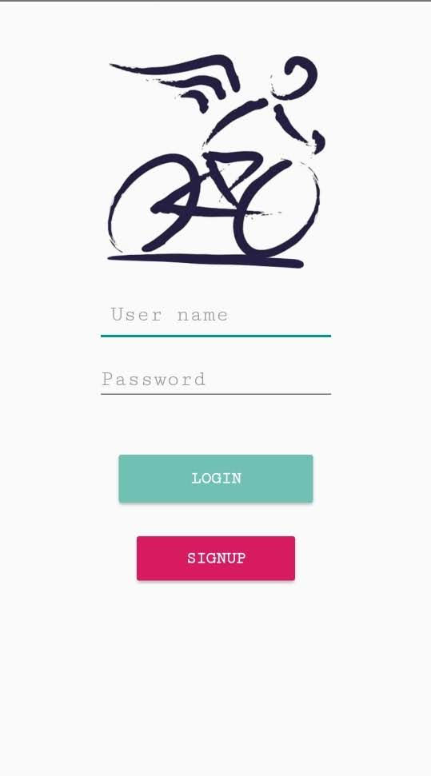
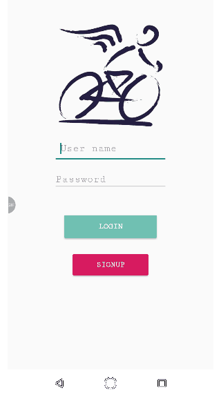
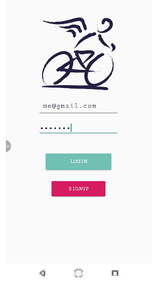
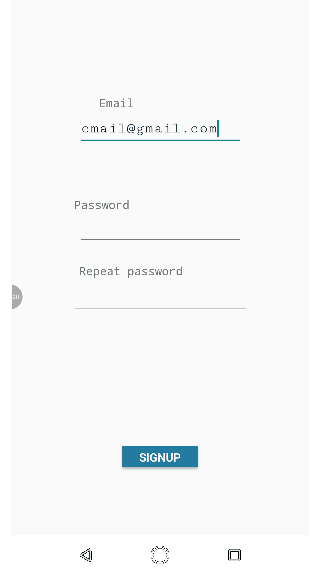
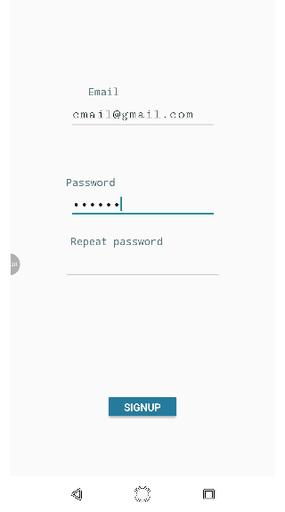
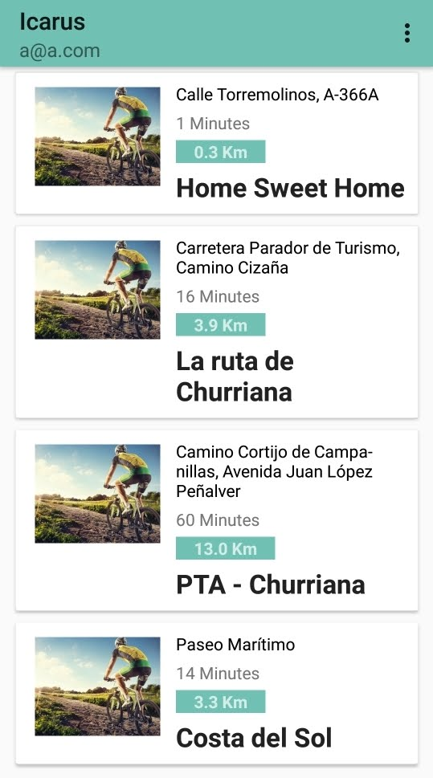
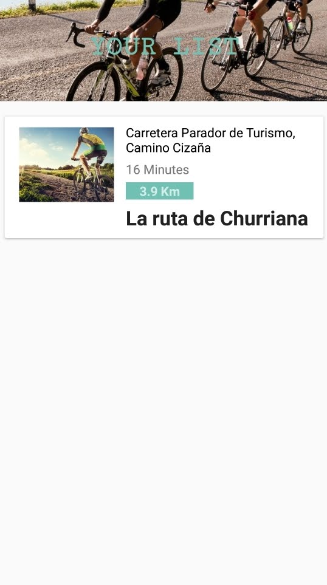
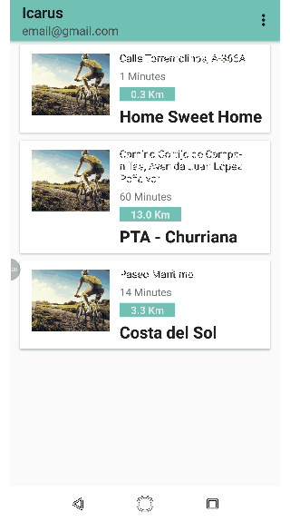
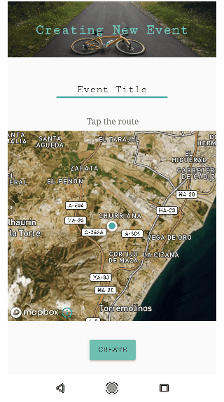

# Icarus
Icarus is an app made by cyclists for cyclists.

## App Activitys:
- Login
- Signup
- Main
- Event Detail
- Your List
- Create Event

## Login
#### The login activity is simply, you just need a registered account to get access to the main acitivity. You can always signup for free.
 
  

## Signup
#### The signup activity. Writing your email and a six minimun characters password will allow you to get your Icarus account ready to use. Dont worry about Spam, we dont send any kind of spam.
    

## Main
#### In the main acitivy you will see all available events right now, you can click on any of them and get to the event detail activity. On the right corner of your app you'll have an options icon, where you can click to move to the "your list" activity or the "create event" activity

## Event Detail
#### On the event detail activity you have the route name, the route in the map and a button to participate in the event.
  

## Your List
#### In your list activity you'll have all the events where you participate, you'll participate in all the events you create
 

## Create Event
#### Creating an event is so easy, writing a title and tapping the rout in the map will do all, then click the undermap button, you'll have your event created and ready to been used by other users.
   

## The END
#### Thanks you for checking this new app and i'll apreciate all your feedback, see you next time.

###### [Here](https://drive.google.com/open?id=1u9t1hNZhrIGN8kCUhst8W5ZFAtQf588e) you can dowload the app and use it for free.
